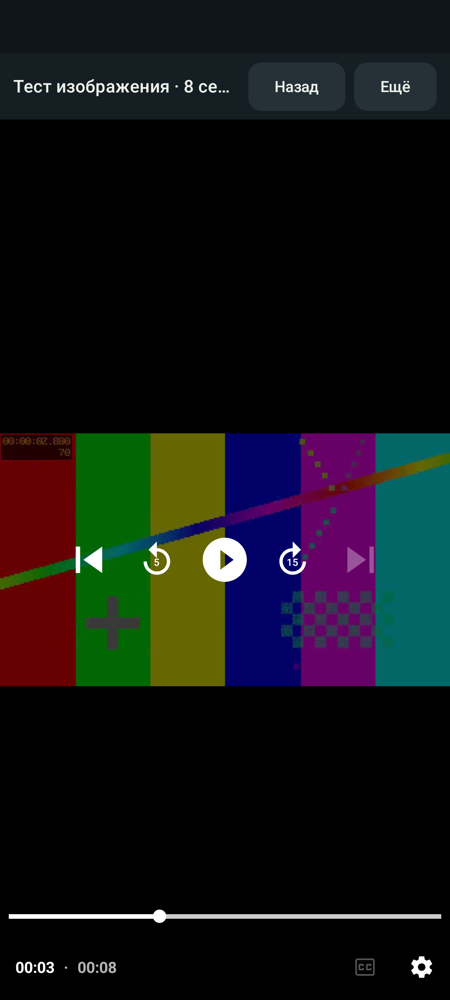

# Android 0.2.0 validation

Version `0.2.0`, code `2`, verified source commit `cc3022e`. This validation applies to the standalone Kotlin/Compose/Media3 application. Historical results for the first version are preserved in [VALIDATION.md](VALIDATION.md).

## Local validation

The Android 15 / API 35 AOSP arm64 emulator `OttplayNativePhone` passed **16 instrumented tests** with no failures or skips. **34 core + 34 Android JVM/Robolectric tests** and **10 release tooling tests** also passed. Structured results with all Android/JVM scenario names: [native-0.2-local-results.json](validation/native-0.2-local-results.json).

Checks include the real service, MediaController IPC, Android Keystore, SQLite, decoder and SurfaceView. The new test launches the real MainActivity with a saved source and verifies video selection, decoding, pause, resume, speed, scaling, returning to the catalogue and continued background playback. Remote input after scrolling a long catalogue is checked separately. A TV layout simulated within a phone test does not replace execution on Android TV OS.

**ClearKey CENC DASH played through real Android MediaDrm.** The test uses a project-owned encrypted video and a local license server. It checks the native POST challenge, key ID, separate Authorization headers for the license and stream, decoded 640×360 video and advancing position. The media and key are test fixtures, with no commercial content: [fixture generation](../app/src/androidTest/assets/playback/clearkey/GENERATION.md).

Resume-position persistence was checked after Activity destruction and release of the first controller: a new controller connected to the same service pauses/seeks, and the position reaches DataStore without a ViewModel. JVM regressions cover ordering between an old service's delayed write and a new seek, retry after storage failure, and consistency after backup import. Importing a mixed backup restores network accounts, favourites, the selected source and positions; an inaccessible local file is skipped with a notice. Invalid positions are rejected before credentials or cache are changed.

DRM unit tests also cover MIME/container handling after IPC, the PlayReady phone restriction, separation of license/stream/provisioning headers, redirect origin checks, and a 4 MiB limit for ordinary, chunked, gzip and error HTTP responses. Tests exposed an incorrect Media3 MIME-inference overload and an error-body eager read that bypassed the limit; both defects were fixed. Independent transport review found no remaining confirmed issues.

## Optimized APK on the emulator

The combined command completed with `BUILD SUCCESSFUL` in 3 minutes 46 seconds. Android lint reported **0 errors, 27 warnings, 1 hint**, without a suppression baseline. R8/resource-shrunk release APK and AAB builds completed.

For local verification, the release APK was signed with the existing SDK debug certificate: `app/build/outputs/apk/local-test/ottplay-native-0.2.0-local-test.apk`, **4,047,250 bytes**, SHA-256 `f6bafc598b8ee4666700ca34d3a59d8301dcd96d15f56f7946d7abd8307fa141`. Android Build Tools 36.0.0 verified APK Signature v2/v3 and alignment. Installation on the test emulator succeeded; the real UI played the bundled clip, and system Pause at 2794 ms produced no media session error. One cold launch took 799 ms; this is a single emulator measurement, not a physical-device performance guarantee.



This is a local test signature with package ID `play.ott.foss.nativeapp`, separate from the stable `.preview` channel. The private SDK key was not uploaded to GitHub, and no new key was created for this check. The historical screenshot preserves the UI localization used during verification.

## GitHub Actions validation and discovered races

The first matrix on commit `1b9fcf8` ([run 34762437710](https://github.com/open-ott-play/ottplay-android/actions/runs/34762437710)) confirmed 68 JVM tests and 10 release tooling checks but failed: 3 of the 16 phone scenarios and 1 of the 16 TV scenarios failed. The initial result is preserved in [native-0.2-github-initial-results.json](validation/native-0.2-github-initial-results.json); it is not successful acceptance of the version.

Logs showed a delayed SystemUI `Stop`: removal of an old session's notification with ID `1001` ran after a new session had been created and stopped the new session. This matches [Android 15 notification-key handling](https://android.googlesource.com/platform/frameworks/base/+/android-15.0.0_r1/packages/SystemUI/src/com/android/systemui/media/controls/domain/pipeline/MediaDataProcessor.kt#595). The ID is now stable within a service instance and changes when the service is recreated. Its counter starts at a random value on process startup and excludes Media3's reserved ID. The system Stop command remains supported. Test cleanup additionally stops the real player through MediaController before releasing the service.

The menu failures involve focus transfer between the separate Dialog window, Activity and keyboard. The initial TV focus request has been moved inside the dialog composition; the player restores focus when the window regains focus. Before hardware commands, the tests check observable window readiness and keyboard state. Timeouts and assertions for decoding, BACK, focus and reopening the menu remain unchanged. The complete matrix must be rerun before release; [current workflow runs](https://github.com/open-ott-play/ottplay-android/actions/workflows/android.yml).

## Builds and release

Combined validation command:

```bash
ANDROID_SERIAL=emulator-5554 ./gradlew --no-daemon \
  :core:test :app:testDebugUnitTest :app:lintDebug \
  :app:connectedDebugAndroidTest :app:assembleRelease :app:bundleRelease
```

The release tooling checks for missing signing configuration or fallback signing, version/code increments, the exact phone+TV matrix, tag conflicts, checksums and artifact substitution. `actionlint` passed for both workflows, as did five regression tests for removing Android builds from the old `ottplay-foss`. An independent review of the preview pipeline confirmed that the Gradle variant matches the APK/AAB paths, certificates are checked for both formats, signing parameters are passed through env/stdin, and the SHA/matrix is checked again before publication; no confirmed blocking defects remained. This validates the infrastructure code and tests, not a completed signed release.

The persistent preview key has not yet been created or uploaded to GitHub Secrets: automatic permission review required separate authorization from the owner. Therefore, a ready release workflow does not mean that persistent signing is already configured or a prerelease has been published. The procedure and exact secret names are in [RELEASING.md](RELEASING.md). The ordinary debug APK uses the local SDK debug signature; unsigned release APK/AAB files are not a completed signed release.

## Result boundaries

The project-owned ClearKey test does not establish Widevine/PlayReady, HDCP, hardware DRM levels, every codec or physical-device subscription compatibility. Physical phones/TVs, real provider accounts, store certification and a production/upload key were not verified or supplied by this test suite. Full behaviour of the 48 older provider scripts, dealer/cloud activation and the custom JSON media library is not claimed; [PROVIDER-COMPATIBILITY.md](PROVIDER-COMPATIBILITY.md) describes standard migration paths.
