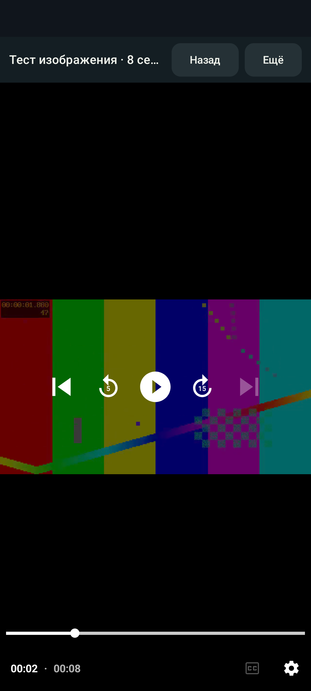

# Android 0.2.0 validation

Version `0.2.0`, code `2`. This document preserves the local results for original commit `cc3022e` and subsequent CI validation of the standalone Kotlin/Compose/Media3 app. Signed [preview v0.2.0-preview.2](https://github.com/open-ott-play/ottplay-android/releases/tag/v0.2.0-preview.2) was published from original commit `f29a4eb`; its equivalent revision after translating the documentation history is [7b0eb46](https://github.com/open-ott-play/ottplay-android/commit/7b0eb46b785a00c308b066318eca4e61e3236378). The [release report](validation/native-0.2-preview-release-results.json) retains the actual build SHA and artifacts, as explained in the [history note](HISTORY.md). Historical results for the first version remain in [VALIDATION.md](VALIDATION.md).

## Local validation

The Android 15 / API 35 AOSP arm64 emulator `OttplayNativePhone` passed **16 instrumented tests** with no failures or skips. **34 core + 34 Android JVM/Robolectric tests** and **10 release tooling tests** also passed. Structured results with all Android/JVM scenario names: [native-0.2-local-results.json](validation/native-0.2-local-results.json).

Checks include the real service, MediaController IPC, Android Keystore, SQLite, decoder and SurfaceView. The new test launches the real MainActivity with a saved source and verifies video selection, decoding, pause, resume, speed, scaling, returning to the catalogue and continued background playback. Remote input after scrolling a long catalogue is checked separately. A TV layout simulated within a phone test does not replace execution on Android TV OS.

**ClearKey CENC DASH played through real Android MediaDrm.** The test uses a project-owned encrypted video and a local license server. It checks the native POST challenge, key ID, separate Authorization headers for the license and stream, decoded 640×360 video and advancing position. The media and key are test fixtures, with no commercial content: [fixture generation](../app/src/androidTest/assets/playback/clearkey/GENERATION.md).

Resume-position persistence was checked after Activity destruction and release of the first controller: a new controller connected to the same service pauses/seeks, and the position reaches DataStore without a ViewModel. JVM regressions cover ordering between an old service's delayed write and a new seek, retry after storage failure, and consistency after backup import. Importing a mixed backup restores network accounts, favourites, the selected source and positions; an inaccessible local file is skipped with a notice. Invalid positions are rejected before credentials or cache are changed.

DRM unit tests also cover MIME/container handling after IPC, the PlayReady phone restriction, separation of license/stream/provisioning headers, redirect origin checks, and a 4 MiB limit for ordinary, chunked, gzip and error HTTP responses. Tests exposed an incorrect Media3 MIME-inference overload and an error-body eager read that bypassed the limit; both defects were fixed. Independent transport review found no remaining confirmed issues.

## Optimized APK on the emulator

The combined command completed with `BUILD SUCCESSFUL` in 3 minutes 46 seconds. Android lint reported **0 errors, 27 warnings, 1 hint**, without a suppression baseline. R8/resource-shrunk release APK and AAB builds completed.

For local verification, the release APK was signed with the existing SDK debug certificate: `app/build/outputs/apk/local-test/ottplay-native-0.2.0-local-test.apk`, **4,047,250 bytes**, SHA-256 `f6bafc598b8ee4666700ca34d3a59d8301dcd96d15f56f7946d7abd8307fa141`. Android Build Tools 36.0.0 verified APK Signature v2/v3 and alignment. Installation on the test emulator succeeded; the real UI played the bundled clip, and system Pause at 2794 ms produced no media session error. One cold launch took 799 ms; this is a single emulator measurement, not a physical-device performance guarantee.


This is a local test signature with package ID `play.ott.foss.nativeapp`, separate from the stable `.preview` channel. The private SDK key was not uploaded to GitHub, and no new key was created for this check. The historical screenshot preserves the UI localization used during verification.

## GitHub Actions validation and discovered races

The first matrix on commit `1b9fcf8` ([run 34762437710](https://github.com/open-ott-play/ottplay-android/actions/runs/34762437710)) confirmed 68 JVM tests and 10 release tooling checks but failed: 3 of the 16 phone scenarios and 1 of the 16 TV scenarios failed. The initial result is preserved in [native-0.2-github-initial-results.json](validation/native-0.2-github-initial-results.json); it is not successful acceptance of the version.

Logs showed a delayed SystemUI `Stop`: removal of an old session's notification with ID `1001` ran after a new session had been created and stopped the new session. This matches [Android 15 notification-key handling](https://android.googlesource.com/platform/frameworks/base/+/android-15.0.0_r1/packages/SystemUI/src/com/android/systemui/media/controls/domain/pipeline/MediaDataProcessor.kt#595). The ID is now stable within a service instance and changes when the service is recreated. Its counter starts at a random value on process startup and excludes Media3's reserved ID. The system Stop command remains supported. Test cleanup additionally stops the real player through MediaController before releasing the service.

Menu failures involved focus handoff between the separate Dialog window, Activity and keyboard. Initial TV focus is now requested within the dialog's composition; the player restores focus when its window regains focus. Before sending hardware keys, tests check observable window readiness and keyboard state. Timeouts and assertions for decoding, BACK, focus and reopening the menu were retained. Acceptance of the current `main` requires a successful full matrix on the same commit; see [current workflow runs](https://github.com/open-ott-play/ottplay-android/actions/workflows/android.yml).

The next [run 34763982972](https://github.com/open-ott-play/ottplay-android/actions/runs/34763982972) on `55c13da` confirmed the fixes: all **16 TV tests**, phone HLS and phone focus checks passed; the phone used four distinct notification IDs without the old `1001`. The only remaining phone failure was caused by `ImmersiveModeConfirmation`, Android's first-fullscreen tutorial. The [full second-run results](validation/native-0.2-github-ui-results.json) retain underlying TestRunner exceptions and OS properties. The test now acknowledges this known system tutorial through UiAutomation after checking the system window type, package and exact framework resource IDs. All **4 UI scenarios passed again locally after resetting the tutorial confirmation**; the log confirmed the click and Android stored `confirmed`. This changed only tests; production code remained at `cc3022e`. See the [first-fullscreen check](validation/native-0.2-first-fullscreen-results.json).

The final [run 34765433919](https://github.com/open-ott-play/ottplay-android/actions/runs/34765433919) on `f29a4eb` succeeded: **68 JVM tests, 10 Python release tooling checks, 16 phone API 35 scenarios and 16 Android TV API 36 scenarios**. All suites reported `failures/errors/skips=0`. The scenarios ran on separate `x86_64` phone and television OS images; the phone log confirmed acknowledgment of the first-fullscreen tutorial.

## Builds and release

Combined validation command:

```bash
ANDROID_SERIAL=emulator-5554 ./gradlew --no-daemon \
  :core:test :app:testDebugUnitTest :app:lintDebug \
  :app:connectedDebugAndroidTest :app:assembleRelease :app:bundleRelease
```

Release tooling checks missing signing configuration and prohibited fallback, increasing version/code, the exact phone+TV matrix, tag conflicts, checksums and artifact substitution. `actionlint` passed for both workflows, as did five regressions covering removal of Android builds from the old `ottplay-foss` project. Independent review of the preview pipeline confirmed that Gradle variants match APK/AAB paths, both formats' certificates are verified, signing values pass through env/stdin, and the SHA/matrix are checked again before publication. No confirmed blockers remained. This infrastructure review preceded the signed release described below.

During initial local validation, automatic approval review blocked creation of the persistent preview key and its upload to GitHub Secrets pending separate owner consent. After explicit consent, preview signing and all five secrets were configured. [Run 34766968610](https://github.com/open-ott-play/ottplay-android/actions/runs/34766968610) published signed [prerelease v0.2.0-preview.2](https://github.com/open-ott-play/ottplay-android/releases/tag/v0.2.0-preview.2) from `f29a4eb`. Verified artifacts, the certificate and CI results are preserved in the [release report](validation/native-0.2-preview-release-results.json). [RELEASING.md](RELEASING.md) documents the procedure and public certificate SHA-256. A production/upload key and Google Play publication remain separate steps; ordinary debug APKs retain the local SDK debug signature.

## Published preview APK verification

The APK downloaded from `v0.2.0-preview.2`, **4,031,187 bytes**, SHA-256 `4e92e7daee56b38d39ebbf019d916c2273c555c7403bba19d8eb9f6269bccef9`, was independently checked against its certificate, package ID, version and checksums. That file was installed on a local Android 15 / API 35 arm64 emulator. The demo source was added through the normal interface and the synthetic clip was opened. A decoded frame was visible; system Play/Pause commands produced `PLAYING` and `PAUSED` states, with the final pause at **1849 ms**, `error=null`. One cold launch took **1082 ms**, a single emulator measurement. The emulator was shut down after verification.



The published AAB separately passed `jarsigner -verify -strict` with the expected public certificate as a trust anchor and `bundletool validate`. Its package ID, version and non-debuggable status matched the APK. Independent verification of the downloaded files did not use the private key. Full public evidence is in the [release report](validation/native-0.2-preview-release-results.json).

## Result boundaries

The project-owned ClearKey test does not establish Widevine/PlayReady, HDCP, hardware DRM levels, every codec or physical-device subscription compatibility. Physical phones/TVs, real provider accounts, store certification and a production/upload key were not verified or supplied by this test suite. Full behaviour of the 48 older provider scripts, dealer/cloud activation and the custom JSON media library is not claimed; [PROVIDER-COMPATIBILITY.md](PROVIDER-COMPATIBILITY.md) describes standard migration paths.
